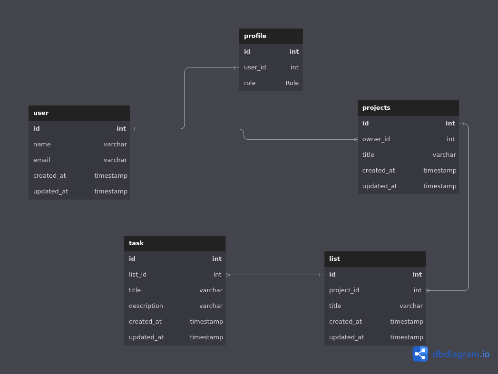
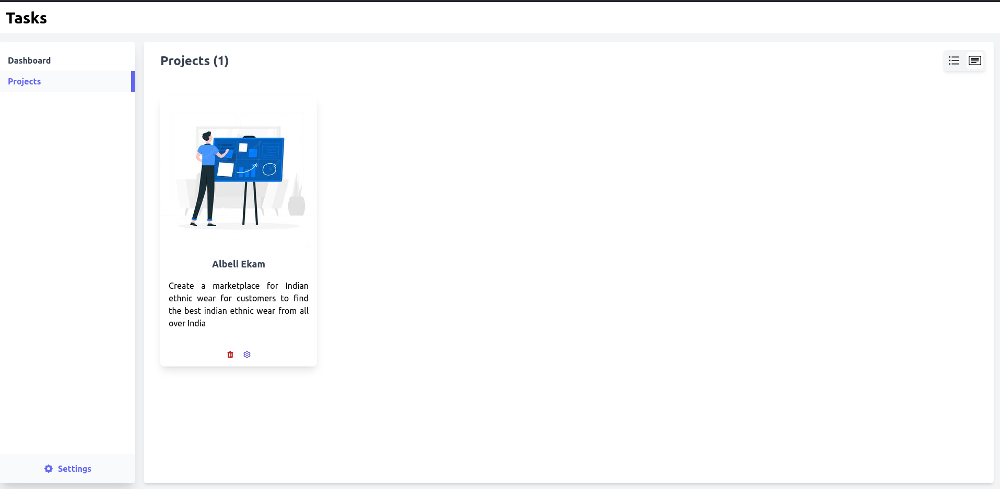

# Task Management
This is a basic project and task management web application which allows users to create their projects, create task lists and create and manage tasks. Each project's task lists can be seen in 2 ways, in a list view or in a Kanban view.

## Table of Contents
- [Task Management](#task-management)
  - [Table of Contents](#table-of-contents)
  - [Tech Stack](#tech-stack)
  - [Deployment](#deployment)
  - [Database Design](#database-design)
  - [App Features](#app-features)
  - [Dashboard Layout](#dashboard-layout)
  - [Upcoming Features](#upcoming-features)

## Tech Stack
* Django
* Reactjs
* Vite
* Tailwindcss

## Deployment
The api server has been deployed on [railway.app](https://railway.app/) and the frontend is deployed on cloudflare pages.

## Database Design

## App Features
What can users do in this application

1. User can create multiple tasks and organize them into projects for easy user.
2. Users can view their tasks in a project using **Kanban View**
3. Every user is part of an organization, of which they are the owners.
4. Users can collaborate with other users by inviting them to their Organization and working on projects together.
5. Implemented user authentication, reset password, email verification of account, external user invitation flow.

## Dashboard Layout

## Upcoming Features
- [ ] Add global settings for a user's account
- [ ] Add different settings for each project, like sending reminder emails, emails when a new task is created, etc.
- [ ] Allow the users to add reminders for each task, notify them on each reminder
